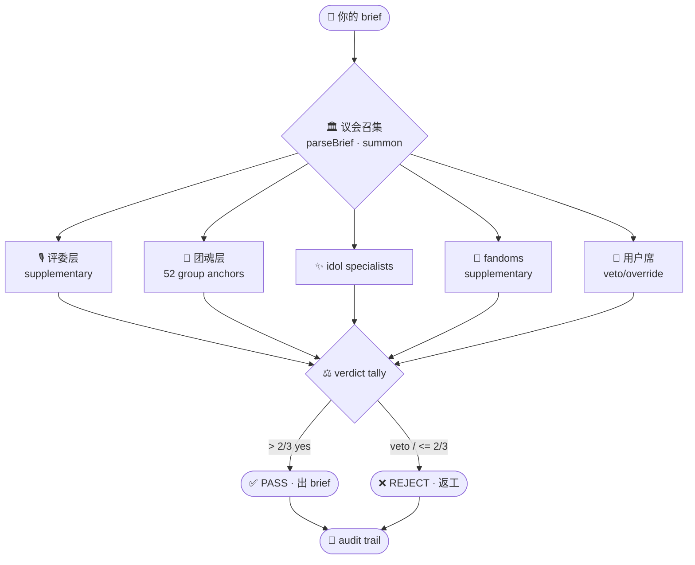

# 🎤 KPOP Design System

> **第一个把 K-pop 工业视觉策略代码化的开源系统。** 186 idol、52 团魂、35 era、5 媒介与 4 代审美，被收束成可测试、可审议、可复用的 mixed council。v3.4 把系统从“有引擎”补齐到“能上手”：Quickstart、LLM bridge、交互式 council CLI、R1/R2/R3 deliberation 与严格 verdict 全部闭环。

[](./CHANGELOG.md)
[](#)
[](#)
[](./LICENSE)

**v3.4 highlights**: v3.4 Quickstart · v3.4 LLM providers (DeepSeek / Claude / Gemini / stub) · v3.4 `bin/council.mjs` · v3.4 mixed council transcripts · v3.4 verification docs.

Install: `npx --yes github:SuanFishXYY/kpop-design-system`

---

## 🚀 Quick start

- 5-minute path: [docs/QUICKSTART.md](./docs/QUICKSTART.md)
- Verify the engine:

```bash
npm test
node examples/council-ive-comeback.mjs
node bin/council.mjs --brief="IVE comeback landing"
```

---

## 🥇 4 真护城河

See [INNOVATION.md](./INNOVATION.md) for the full argument.

| Moat | What is encoded | Why it matters |
|---|---|---|
| **Era-as-Contract** | `engine/eras.mjs` locks palette / MV grammar / forbidden moves per album era | “TWICE Fancy” cannot drift back to “Cheer Up” pink. |
| **Generation-as-Lint** | `engine/generation.mjs` detects 2/3/4/5-gen aesthetic mismatch | 5th-gen cyber rules and 2nd-gen bright grammar become testable constraints. |
| **Mixed Council with Veto** | `council-assembly` + `deliberation` + `verdict` | Idol specialists, group anchors, and user all vote; strict `> 2/3` closes the loop. |
| **Voice + Counterpoint** | `voice-synthesis` + 10 counterpoint pairs | Group identity speaks in its own voice and keeps productive rival tension. |

---

## 🏛️ 议会构成

Fandoms and judges remain **supplementary roles** for broad v2/v3 compatibility; v3.4 canonical runtime centers the compact mixed council.

| Layer | 数量 | weight | veto | 角色 |
|-------|------|--------|------|------|
| 🎙️ **评审团 (judges/)** | 7 | 5 | portfolio_only | supplementary role · JYP / YG / SM / HYBE / ADOR / Starship / THEBLACKLABEL |
| 🎤 **团代表 (groups/)** | 52 | 3 or unit vote | yes | 每团 group_anchor · palette + eras + rivals + counterpoint |
| ✨ **舞台担当 (Tier 0)** | 71 | 2 or unit vote | no | 主推 idol specialists |
| 💫 **舞台助攻 (Tier 1)** | 45 | 1.5 or unit vote | no | 跨团助攻 |
| 📣 **现场投票 (fandoms/)** | 45 | 1 | no | supplementary role · 观众视角 |
| 🧑 **用户席** | 1 | 1-3 or unit vote | yes | final taste authority · veto / override |



---

## 📜 Version history

| Version | Focus |
|---|---|
| **v3.4** | LLM bridge + Quickstart + canonical CLI `bin/council.mjs` + verification docs |
| **v3.3** | Mixed Council: relations, assembly, voice synthesis, deliberation, verdict |
| **v3.1** | User-as-Judge: user vote, veto / override, preference memory |
| **v3.0** | Era Universe, Comeback Cycle, Multi-touchpoint Coherence, Generation Lint |
| **v2.x** | roster expansion, routing, weighted voting, conflict mechanics |

Full details: [CHANGELOG.md](./CHANGELOG.md).

---

## 📚 Docs index

- [QUICKSTART](./docs/QUICKSTART.md) — 5-minute onboarding
- [COUNCIL-FLOW-DIAGRAM](./docs/COUNCIL-FLOW-DIAGRAM.md) — brief → verdict path
- [ARCHITECTURE](./docs/ARCHITECTURE.md) — directory map + 16-engine graph
- [INNOVATION](./INNOVATION.md) — why this is more than a theme wrapper
- [MIXED-COUNCIL-PROTOCOL](./docs/MIXED-COUNCIL-PROTOCOL.md) — v3.3/v3.4 protocol
- [AESTHETIC-COUNTERPOINT-PAIRS](./docs/AESTHETIC-COUNTERPOINT-PAIRS.md) — 10 explicit counterpoints
- [CLI-INTERACTIVE-COUNCIL](./docs/CLI-INTERACTIVE-COUNCIL.md) — `bin/council.mjs` usage
- [LLM-VERIFICATION](./docs/LLM-VERIFICATION.md) — live provider smoke checks
- [ERA-UNIVERSE](./docs/ERA-UNIVERSE.md) · [COMEBACK-CYCLE](./docs/COMEBACK-CYCLE.md) · [TOUCHPOINT-COHERENCE](./docs/TOUCHPOINT-COHERENCE.md) · [GENERATION-AESTHETICS](./docs/GENERATION-AESTHETICS.md)
- [CONFLICT-MECHANICS](./docs/CONFLICT-MECHANICS.md) · [USER-AS-JUDGE](./docs/USER-AS-JUDGE.md)
- [scripts/README](./scripts/README.md) — script lifecycle and run policy

---

## 🔬 Verify yourself

- Deterministic suite: `npm test`
- v3.4 LLM smoke: [docs/LLM-VERIFICATION.md](./docs/LLM-VERIFICATION.md)
- Architecture audit: [docs/ARCHITECTURE.md](./docs/ARCHITECTURE.md)
- CLI dry run: `node bin/council.mjs --brief="quick test"`

---

## 🌐 触发短语

`/kpop` · `/kpop design` · `/kpop awards` · `/kpop era` · `/女团` · `/idol-congress` · “TWICE Fancy era” · “IVE comeback 30 天” · “BLACKPINK 周边一致性”

## 📄 License

MIT · 算鱼工作室 · 2025-2026
