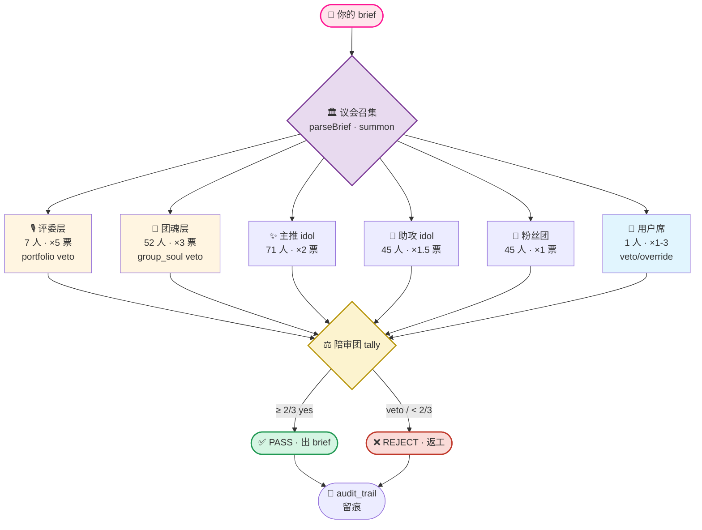
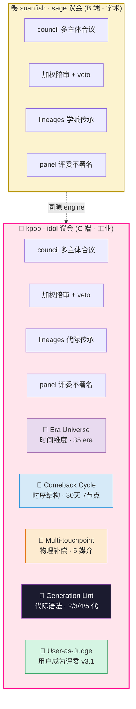
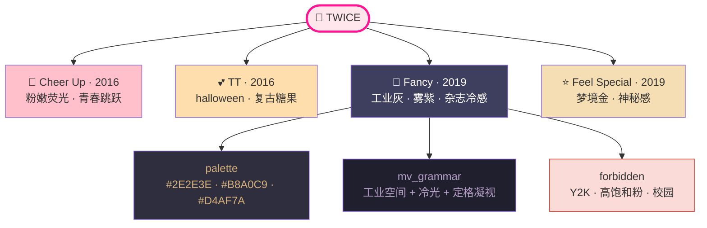
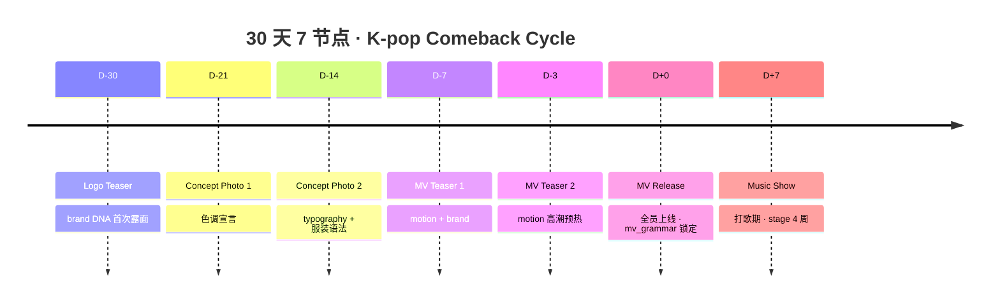
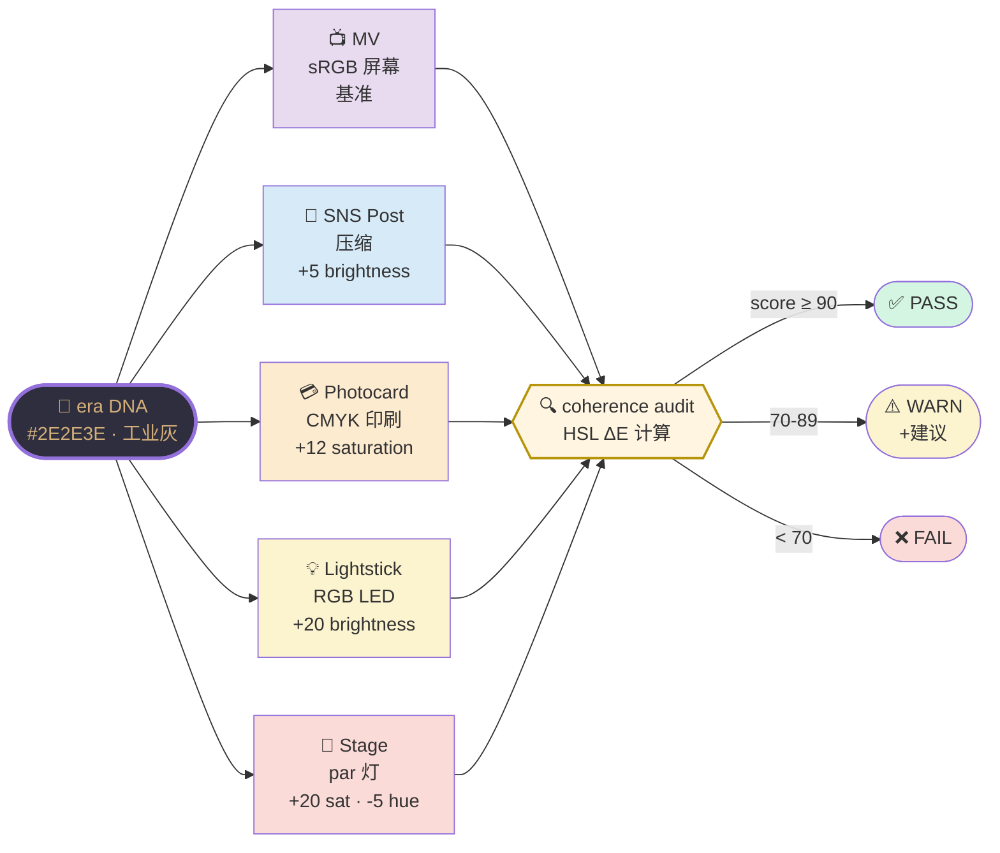
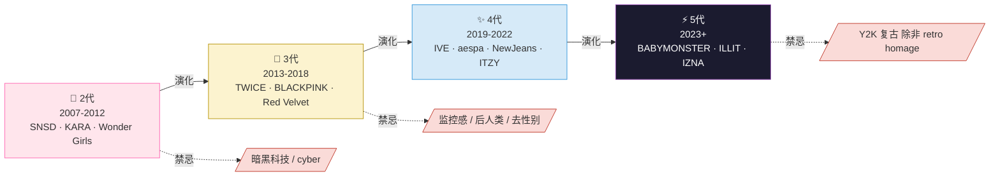
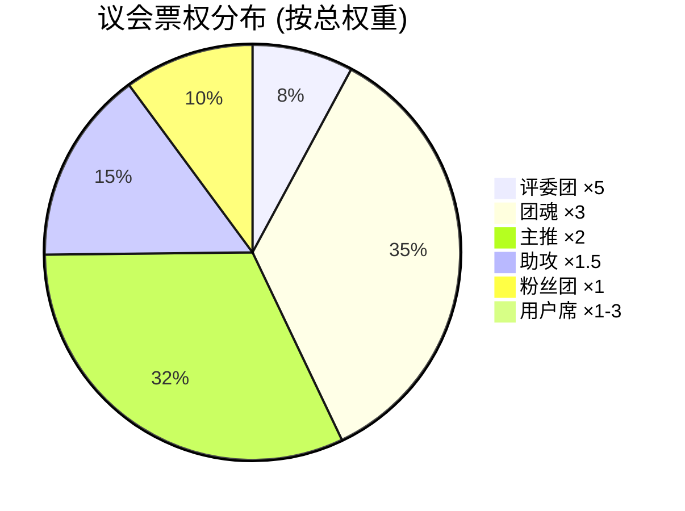

# 🎤 KPOP Design System

> **"设计不是一个人拍板。是 218 个灵魂的议会合议。"**

[](./CHANGELOG.md)
[](#)
[](#)
[](#)
[](#)
[](./LICENSE)

---

## 🌌 这是什么

这不是一个 UI 工具。

这是一个**世界观**——

把 K-pop 这个全球流行文化最严苛的视觉工业,
反向蒸馏成一套**可代码化的设计哲学**。



---

## 🎯 为什么需要这个系统

> 一个开源项目讲不清"能干嘛 + 凭什么", star 永远涨不起来. 这里诚实交代.

### 📦 能用来干嘛 · 4 档真实用例

| 档位 | 场景 | 谁会用 |
|------|------|------|
| 🥇 直接生产力 | K-pop 视觉策划 · 粉丝周边 · 主题营销 · 演唱会海报 | K-pop 厂牌设计团队 / 粉丝创作者 / MCN / 演出策划 |
| 🥈 多 agent 框架模板 | 抄 schema + 6 协作 + 6 冲突 → 做你自己领域的议会 | 想自建"代码审议会 / 学术评审会 / 美食评论团"的工程师 |
| 🥉 LLM coding agent 压测场 | CRLF / YAML / 186 文件批量约束 — 工程难度大 | 想验证 Claude Code / Cursor / Copilot 真实工程能力的人 |
| 🥹 教学 / 灵感来源 | 看懂"行业 know-how → schema 逆向蒸馏"怎么做 | 想学多 agent 系统设计方法论的人 |

### ⚡ 真正的优势 (相对其他 multi-agent 系统)

| 维度 | 别人 | 这套系统 |
|------|------|------|
| **agent 差异化** | 名字不同, prompt 模板相同 | **186 个全字段不同** · 8 差异化轴 ([ANATOMY](./docs/AGENT-ANATOMY.md)) · 每个可独立 standalone 调用 |
| **冲突处理** | "大家协商" / 多数过 | **6 种冲突机制全编码** · rivalry / cross-label / generation / veto / divergence / personal ([CONFLICT](./docs/CONFLICT-MECHANICS.md)) · 不磨平, 显性化 |
| **时间维度** | 无 | **era 锁** · 每团每张专辑独立视觉宇宙 · 30 天 7 节点 comeback 日历 |
| **代际约束** | 无 | **generation lint** · 5 代团禁 Y2K · 2 代团禁 cyber · 错位 reject |
| **投票权重** | 一人一票 | **5/3/2/1.5/1 工业层级** · 评委 ×5 / 团魂 ×3 / Top idol ×2 · 不是民主, 是工业 |
| **跨组织平衡** | 无 | **cross-label gate 硬约束** · SM × HYBE 合作必须每方至少 1 评委 |
| **内容政策** | 全靠 LLM 自己拿捏 | **R-Personal 硬编码** · 只编码公开法律/商业事实, 拒绝指控/八卦 |
| **数据来源** | 凭空设计 schema | **逆向蒸馏** · 从真实 K-pop 工业 20 年 know-how 反向提取 ([INNOVATION](./INNOVATION.md)) |
| **双议会孪生** | 单项目 | **kpop ↔ sage 同源引擎** · 同代码不同领域表达 |

### ⚠️ 承认的局限 (P8 不藏)

- **领域窄**: 真要做电商/SaaS UI, 直接用更好. 这套是 K-pop niche + 可复用框架.
- **不出像素**: 输出 brief/strategy, 不直接生成 KV — 需要后接 LLM/设计师真出图.
- **依赖 LLM**: council voice 差异化要靠 Claude/GPT 实际生成才显, 单跑 engine 是 metadata.
- **186 agent 维护成本**: 加新成员要补全 8 字段 + invited_helpers 关系网 — 不是抄名字了事.
- **K-pop 文化锁**: 不懂 era/comeback/fandom 概念的用户, 学习曲线陡.

### 🔑 一句话总结

> 这不是"K-pop 主题的 chatbot 包装".
>
> 这是**一套把整个 K-pop 工业 know-how 编码成可验证工程信号**的开源系统 ——
> 你可以拿它做 K-pop 视觉; **更重要的是, 你可以抄走这套范式做你自己领域的议会**.
>
> 三件套缺一不可: 逆向蒸馏的 schema · 结构化协作 · 显性化冲突.

---

## 🎭 双议会 · sage vs idol

> **这套系统不是凭空冒出来的。它有母体。**

母体是 [suanfish-design-system](https://github.com/SuanFishXYY/suanfish-design-system)——
一套以**黑格尔、塞尚、巴赫**为 council 的"sage 议会",处理严肃 B 端 / SaaS / 学术工具的设计决策。

KPOP Design System 是它的**孪生**:
把 council 的人选从黑格尔、塞尚、巴赫换成 **Jennie、Wonyoung、Karina**,
把战场从学术工具迁移到**娱乐 / 内容平台 / 时尚消费**。

但**不只是换了人选**——
kpop 引入了 sage 议会**完全没有**的 **5 个工业子系统**,因为 K-pop 是一个有真实时间、真实物理、真实代际的产业。



底层架构**同源** (engine/dispatch + voting + routing) · 表达语言**完全不同** · **kpop 在工业现实层多了 5 个独立子系统**。

| 维度 | 🎭 suanfish (sage) | 🎤 kpop (idol) |
|------|-----------------|--------------|
| council 池 | 哲学家·艺术家·音乐家·科学家 | KPOP idol |
| 触发风格 | 学术 · 哲学 | 流行 · 视觉强烈 |
| 适用场景 | B 端 SaaS / 工具 / 学术 | C 端 / 娱乐 / 时尚 / 内容 |
| 角色数 | 420 thinker · 52 agent | 186 idol · 52 团魂 · 7 评委 · 45 fandom |
| **时间维度** | ❌ (sage 是永恒的) | ✅ **Era Universe** · 35 era |
| **时序结构** | ❌ (一次决议) | ✅ **Comeback Cycle** · 30 天 7 节点 |
| **物理补偿** | ❌ (主要数字端) | ✅ **5 媒介补偿** · MV/SNS/PC/LS/Stage |
| **代际语法** | ❌ (sage 无代际) | ✅ **Generation Lint** · 2/3/4/5 代 |
| **对决/合作** | ❌ | ✅ **rivalry** + **fusion** + cross-label gate |
| **用户席** | ❌ | ✅ **User-as-Judge** · veto/override (v3.1) |

### 为什么 kpop 要多这 5 个?

因为 K-pop 是一个**有真实工业事实的产业**——

- 🌌 *Fancy* era 不能用 *Cheer Up* era 的视觉 → **时间**有约束
- 📅 一次 comeback 不是 1 张图,是 30 天 7 节点的剧本 → **时序**有结构
- 🎨 MV 的灰印在 photocard 上不是同一种灰 → **物理**有补偿
- 🧬 5 代团用 Y2K 就是错 → **代际**有语法
- 🧑 设计不是 AI 单方面给,用户得有否决权 → **用户**有票席

> **sage 议会**处理 *"什么是好设计"* 的**永恒问题**。
> **kpop 议会**处理 *"什么是 K-pop 工业级好设计"* 的**工业问题**。

未来 v4.0 计划: **联袂议会** — 让**黑格尔和 Jennie 同台辩论**一个 brief。

---

## 🧠 五条哲学律

### ❶ 设计是**多主体的合议**,不是单作者的独白

LLM 容易给出一个"看起来对"的答案。
真实的设计决策从来不是一个人拍板——
它是 art director、brand strategist、motion designer、photography lead、market、粉丝、用户……
**多方角力的产物**。

本系统把这种"多主体性"原封不动地写进代码:
- 7 评审团 (JYP/YG/SM/HYBE...) · `weight × 5` · 持 portfolio_only veto
- 52 团魂 group_anchor · `weight × 3` · 持 group_soul veto
- 186 idol 担当 · `weight × 1.5–2` · 各自 own 一个设计维度
- 45 粉丝团 fandom · `weight × 1` · 观众视角
- 1 用户席 · `weight × 1–3` · 持 override / veto (v3.1)

**brief 不再是 prompt,brief 是召集令。**

### ❷ 设计有**时间维度**,不是平铺的色板

设计不是一张色卡可以概括的。
TWICE 的 *Cheer Up* (2016) 和 *Fancy* (2019) 是**两套完全不同的视觉宇宙**——
前者是粉嫩荧光的青春,后者是工业灰雾紫的冷感。

我们用 **Era Universe** 系统把这种时间性编码进引擎:
- 35 个被精挑细选的 era,每个含: palette / mood / mv_grammar / typography_keywords / forbidden
- 命中 era → 自动 lock 视觉语言, 禁止跨 era 串味

```js
getEraLockedDNA("TWICE Fancy era 化妆品 hero");
// → palette { #2E2E3E · #B8A0C9 · #D4AF7A }
//   mv_grammar "工业空间 + 冷光 + 定格凝视"
//   forbidden ["Y2K 贴纸", "高饱和粉", "校园元素"]
```



**era 不是元数据,era 是合约。**

### ❸ 设计是**时序结构**,不是一张 KV

一次 K-pop comeback 从来不是"出一张 hero 图就完了"——
它是 30 天 7 节点的视觉叙事:

```
D-30 ━━ Logo Teaser            (brand DNA 第一次露面)
D-21 ━━ Concept Photo 1        (色调宣言)
D-14 ━━ Concept Photo 2        (typography + 服装语法)
D-7  ━━ MV Teaser 1            (motion + brand)
D-3  ━━ MV Teaser 2            (motion 高潮预热)
D+0  ━━ MV Release             (全员上线)
D+7  ━━ Music Show (4 周)      (stage + 实时投票)
```

**Comeback Cycle** 把这套节奏写成 dispatch 协议——
每个节点优先召唤匹配的 ui_specialty 担当。
D-7 期的 brief 会自动注入 `mv_grammar`,保证 MV 期视觉语法不漂移。



**设计交付不是终点,是开播。**

### ❹ 设计要对**物理世界**负责

屏幕上的 `#2E2E3E` 印在 photocard 上是另一种灰,
搬到 lightstick LED 又是另一种灰,
打在舞台 par 灯下是第四种灰。

设计师如果只在 Figma 里调色,就是在欺骗物理。

**Multi-touchpoint Coherence** 编码了 5 个媒介的物理补偿:

| 媒介 | 物理性质 | 补偿系数 |
|------|---------|---------|
| MV | sRGB · 屏幕 | 基准 |
| SNS Post | sRGB · 压缩 | brightness +5 |
| Photocard | CMYK · 印刷 | saturation +12 |
| Lightstick | RGB LED · 高对比 | brightness +20 |
| Stage | par 灯 · 偏暖偏曝 | saturation +20, hue -5 |

audit 这五个媒介的设计稿,输出一致性分数 + 每媒介偏差建议。



**视觉不能背叛它要落地的介质。**

### ❺ 设计有**代际语法**,错位即失败

2007 年的 SNSD 不会用 5 代的暗黑科技,
2024 年的 ILLIT 用 Y2K 复古是一种**罪**——
除非她明确标注 retro homage。

```
2代 (~2007-2012)   鲜艳高饱和 + 粉嫩 + 大头特写
3代 (~2013-2018)   Y2K + 杂志大片 + 黑白对照
4代 (~2019-2022)   极简 + AI cyber + 公主 + 校园清爽并存
5代 (~2023+)       暗黑科技 + 监控感 + AI 后人类 + 去性别
```

**Generation Lint** 把这套代际语法编成检测律:
brief 关键词 vs 团 generation 错位 → 警告或拒绝。

```js
checkGenerationAesthetic("ILLIT 用 Y2K 复古风", "illit");
// → violation: "Y2K 是 3代 语法; 5代 ILLIT 应走 暗黑科技 / AI 后人类"
```

**审美有代际,不分清谁穿越谁,设计就是错的。**



---

## 🧑‍⚖️ 用户成为评委 (v3.1)

这套系统不是要把用户排除在外。

v3.1 引入 **User-as-Judge**——
用户与 idol 评审团并肩坐进 council:

- 默认占 1 席 (与团代表 anchor 同级)
- 可自抬权重至 3 票
- 即便 council 全 pass,用户可 **veto** → 强制返工
- 即便 council 全 reject,用户可 **override** → 标注 `user_override:true` 留痕
- 本地偏好学习 (`~/.kpop-design/user-prefs.json` · 不上传):
  - 记录最近 50 次 override
  - 偏好的 era / group / specialty
  - 反复拒绝的提案自动跳过

```js
import { tallyWithUser, castUserVote } from "./engine/user-jury.mjs";

const userVote = castUserVote("reject", 2, "色调和 era 不符");
const result = tallyWithUser(councilVotes, userVote);
// → { final_verdict: "user_veto", audit_trail: [...] }
```

**用户不是上帝,但也不是被告。用户是评委。**

---

## 🚀 一行召唤

```bash
npx --yes github:SuanFishXYY/kpop-design-system
```

自动注册到 6 个 CLI 平台 (Copilot · Claude · Codex · Gemini · Antigravity · 通用 agents)。

装完即用,无需手动 `/skill add`。

---

## 🎬 走进议会

```bash
git clone https://github.com/SuanFishXYY/kpop-design-system.git
cd kpop-design-system

# 五条哲学律的代码 demo
node examples/era-demo.mjs           # ❷ Era Universe
node examples/cycle-demo.mjs         # ❸ Comeback Cycle
node examples/coherence-demo.mjs     # ❹ Multi-touchpoint
node examples/generation-demo.mjs    # ❺ Generation Lint
node examples/user-jury-demo.mjs     # 🧑‍⚖️ User-as-Judge

# 真议会 (交互式)
node bin/review.mjs --brief="TWICE Fancy era landing"
```

---

## 📚 哲学手册

| 文档 | 内容 |
|------|------|
| [`docs/ERA-UNIVERSE.md`](docs/ERA-UNIVERSE.md) | 时间宇宙 · 35 era 大全 |
| [`docs/COMEBACK-CYCLE.md`](docs/COMEBACK-CYCLE.md) | 时序结构 · 30 天 7 节点 |
| [`docs/TOUCHPOINT-COHERENCE.md`](docs/TOUCHPOINT-COHERENCE.md) | 物理补偿 · 五媒介手册 |
| [`docs/GENERATION-AESTHETICS.md`](docs/GENERATION-AESTHETICS.md) | 代际语法 · 2/3/4/5 代时间线 |
| [`docs/USER-AS-JUDGE.md`](docs/USER-AS-JUDGE.md) | 用户票席 · Override 协议 |
| [**`INNOVATION.md`**](INNOVATION.md) | **🧠 创新点分档拆解** · 真原创 / 组合创新 / 应用迁移 |
| [`CHANGELOG.md`](CHANGELOG.md) | 哲学演进史 |

---

## 🧪 议会的可靠性

```
dispatch  ━━━━━━━━━━━━━  25 PASS
voting    ━━━━━━━━━━━━━   7 PASS
routing   ━━━━━━━━━━━━━  14 PASS
eras      ━━━━━━━━━━━━━  10 PASS
cycle     ━━━━━━━━━━━━━   5 PASS
coherence ━━━━━━━━━━━━━   6 PASS
generation━━━━━━━━━━━━━   7 PASS
user-jury ━━━━━━━━━━━━━   6 PASS
user-prefs━━━━━━━━━━━━━   6 PASS
━━━━━━━━━━━━━━━━━━━━━━━━━━━━━━━━━━
                          86 / 86
```

**0 fail · 0 skip · 0 todo**。议会决议是真打分,不是 LLM 装。

---

## 🏛️ 系统全貌

| Layer | 数量 | weight | veto |
|-------|------|--------|------|
| 🎙️ 评审团 (judges) | 7 | 5 | portfolio_only |
| 🎤 团魂 (group_anchors) | 52 | 3 | yes (group_soul) |
| ✨ 主推 (performer_t0) | 71 | 2 | no |
| 💫 助攻 (performer_t1) | 45 | 1.5 | no |
| 📣 粉丝团 (fandoms) | 45 | 1 | no |
| 🧑 用户席 (v3.1) | 1 | 1–3 | yes (veto/override) |
| **合计** | **221** | — | — |

35 era · 5 媒介 · 4 代审美 · 30 天 7 节点 · 86/86 tests



---

## 📄 License

MIT · 算鱼工作室 · 2025-2026

> 设计哲学是可以被代码化的。
> 这只是一个开始。
