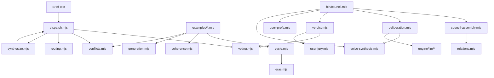

# Architecture Map · KPOP Design System v3.4.2

This document is the contributor map for the repository. It turns the project from a set of engines into an operable system: where data lives, how the council flows, and what to touch when adding a new engine, group, or LLM provider.

## 1. Top-level layout

### engine/
Runtime engines and tests. Every behavior that needs verification lives here.

### groups/
52 group anchors with group_slug, era, aesthetic tags, rivals, counterpoint axes, palettes, voice templates, and eras.

### agents/
Idol specialists with tier, role, UI specialty, group membership, personality, and helper links.

### fandoms/
Audience proxy roles. Supplementary in v3.4 mixed council but kept for legacy weighted council coverage.

### judges/
Label or portfolio judges. Supplementary roles with high legacy vote weight and portfolio-only veto scope.

### lineages/
Cross-generation inheritance notes and aesthetic lineage data.

### stages/
Award or work-stage definitions used by older council flows.

### workflows/
Protocol docs for recurring flows such as comeback cycles.

### docs/
Contributor and user documentation: quickstart, council protocol, LLM verification, and architecture.

### examples/
Executable demos. A demo should prove one concrete engine use case without hidden setup.

### bin/
CLI entry points. v3.4 canonical CLI is bin/council.mjs.

### scripts/
Maintenance and generation scripts. See scripts/README.md for lifecycle status.

### installer/
CLI registration and install helper.

## 2. Engine dependency graph



### Dependency notes

- `dispatch` parses the brief, summons legacy weighted council members, applies conflict checks, and can be paired with `routing` for model tier allocation.
- `council-assembly` owns the v3.4 compact mixed council. It calls `relations` to invite sister groups by generation, agency, aesthetic overlap, and counterpoint.
- `deliberation` owns R1/R2/R3. It calls `voice-synthesis` for deterministic group voice and can call `engine/llm/*` when `--llm` is enabled.
- `verdict` classifies R3 clauses and reuses `voting` plus `user-jury` for strict `> 2/3` verdicts and user veto/override.

## 3. Data flow

1. User writes a brief: group, era, touchpoint, or visual strategy request.
2. Assembly finds seed groups/idols and creates a 5- or 7-seat mixed council.
3. Relations invite sister groups: same generation, same agency, same aesthetic, or aesthetic counterpoint.
4. Voice synthesis gives each group anchor a non-generic stance and veto triggers.
5. Deliberation runs R1 independent statements, R2 cross-questions, and R3 final stances.
6. Verdict classifies consensus, compromise, and dissent clauses.
7. Vote closes the loop with strict threshold plus user veto or override.
8. CLI writes a verdict markdown file and prints the audit trail summary.

## 4. Sixteen engines table

| Engine | Purpose | Key API | Imported by | Status |
|---|---|---|---|---|
| `dispatch.mjs` | Legacy weighted council dispatcher | `parseBrief, summonCouncil` | examples, synthesize | production |
| `voting.mjs` | Weighted vote tally and eligibility | `tallyCouncilVotes` | dispatch, verdict | production |
| `routing.mjs` | Cost-aware model tier plan | `getRoutingPlan` | examples, docs | production |
| `synthesize.mjs` | Design DNA aggregation | `synthesizeDesignDNA` | examples | production |
| `conflicts.mjs` | Personal and label-dispute advisories | `checkPersonalConflict` | dispatch, examples | production |
| `eras.mjs` | Era-locked group DNA | `getEraLockedDNA` | cycle, examples | production |
| `cycle.mjs` | Comeback 30-day stage calendar | `dispatchComebackCycle` | examples | production |
| `coherence.mjs` | Multi-touchpoint consistency audit | `auditTouchpointCoherence` | examples | production |
| `generation.mjs` | Generation aesthetic lint | `checkGenerationAesthetic` | examples | production |
| `user-jury.mjs` | User vote/veto adapter | `castUserVote, tallyWithUser` | verdict, council CLI | production |
| `user-prefs.mjs` | Local preference memory | `loadUserPrefs, recordFavorite` | council CLI | production |
| `relations.mjs` | Sister group relation discovery | `getAllSisterGroups` | council-assembly | production |
| `council-assembly.mjs` | Compact mixed council assembly | `assembleCouncil` | bin/council | production |
| `voice-synthesis.mjs` | Group voice template synthesis | `synthesizeVoice` | deliberation, bin/council | production |
| `deliberation.mjs` | R1/R2/R3 deliberation with optional LLM | `orchestrateDeliberation` | bin/council | production |
| `verdict.mjs` | Clause classification and strict verdict | `classifyClauses, tallyVote` | bin/council | production |

### dispatch.mjs
- Purpose: Legacy weighted council dispatcher.
- Key API: `parseBrief, summonCouncil`.
- Imported by: examples, synthesize.
- Status: production.
- Verification: add or update the matching `engine/*.test.mjs` file before changing behavior.

### voting.mjs
- Purpose: Weighted vote tally and eligibility.
- Key API: `tallyCouncilVotes`.
- Imported by: dispatch, verdict.
- Status: production.
- Verification: add or update the matching `engine/*.test.mjs` file before changing behavior.

### routing.mjs
- Purpose: Cost-aware model tier plan.
- Key API: `getRoutingPlan`.
- Imported by: examples, docs.
- Status: production.
- Verification: add or update the matching `engine/*.test.mjs` file before changing behavior.

### synthesize.mjs
- Purpose: Design DNA aggregation.
- Key API: `synthesizeDesignDNA`.
- Imported by: examples.
- Status: production.
- Verification: add or update the matching `engine/*.test.mjs` file before changing behavior.

### conflicts.mjs
- Purpose: Personal and label-dispute advisories.
- Key API: `checkPersonalConflict`.
- Imported by: dispatch, examples.
- Status: production.
- Verification: add or update the matching `engine/*.test.mjs` file before changing behavior.

### eras.mjs
- Purpose: Era-locked group DNA.
- Key API: `getEraLockedDNA`.
- Imported by: cycle, examples.
- Status: production.
- Verification: add or update the matching `engine/*.test.mjs` file before changing behavior.

### cycle.mjs
- Purpose: Comeback 30-day stage calendar.
- Key API: `dispatchComebackCycle`.
- Imported by: examples.
- Status: production.
- Verification: add or update the matching `engine/*.test.mjs` file before changing behavior.

### coherence.mjs
- Purpose: Multi-touchpoint consistency audit.
- Key API: `auditTouchpointCoherence`.
- Imported by: examples.
- Status: production.
- Verification: add or update the matching `engine/*.test.mjs` file before changing behavior.

### generation.mjs
- Purpose: Generation aesthetic lint.
- Key API: `checkGenerationAesthetic`.
- Imported by: examples.
- Status: production.
- Verification: add or update the matching `engine/*.test.mjs` file before changing behavior.

### user-jury.mjs
- Purpose: User vote/veto adapter.
- Key API: `castUserVote, tallyWithUser`.
- Imported by: verdict, council CLI.
- Status: production.
- Verification: add or update the matching `engine/*.test.mjs` file before changing behavior.

### user-prefs.mjs
- Purpose: Local preference memory.
- Key API: `loadUserPrefs, recordFavorite`.
- Imported by: council CLI.
- Status: production.
- Verification: add or update the matching `engine/*.test.mjs` file before changing behavior.

### relations.mjs
- Purpose: Sister group relation discovery.
- Key API: `getAllSisterGroups`.
- Imported by: council-assembly.
- Status: production.
- Verification: add or update the matching `engine/*.test.mjs` file before changing behavior.

### council-assembly.mjs
- Purpose: Compact mixed council assembly.
- Key API: `assembleCouncil`.
- Imported by: bin/council.
- Status: production.
- Verification: add or update the matching `engine/*.test.mjs` file before changing behavior.

### voice-synthesis.mjs
- Purpose: Group voice template synthesis.
- Key API: `synthesizeVoice`.
- Imported by: deliberation, bin/council.
- Status: production.
- Verification: add or update the matching `engine/*.test.mjs` file before changing behavior.

### deliberation.mjs
- Purpose: R1/R2/R3 deliberation with optional LLM.
- Key API: `orchestrateDeliberation`.
- Imported by: bin/council.
- Status: production.
- Verification: add or update the matching `engine/*.test.mjs` file before changing behavior.

### verdict.mjs
- Purpose: Clause classification and strict verdict.
- Key API: `classifyClauses, tallyVote`.
- Imported by: bin/council.
- Status: production.
- Verification: add or update the matching `engine/*.test.mjs` file before changing behavior.

## 5. Adding a new engine

1. Add `engine/<name>.mjs` with pure functions first; avoid hidden network or file writes unless the engine's purpose is persistence.
2. Add `engine/<name>.test.mjs` and include it in `scripts/run-all-tests.mjs` if the runner does not discover it automatically.
3. Add one example or docs reference showing the engine's concrete use case, then update this architecture table.

## 6. Adding a new group

Required frontmatter schema:

```yaml
---
name: group-soul-example
description: 团魂 · Example Group
layer: group_anchor
group_slug: example
group_name: "Example Group"
era: "5 代"
counterpoint_axis: "Example contrast vs counterpart"
aesthetic_tags: ["tag-one", "tag-two"]
agency: "Example Label"
founded_year: 2026
core_aesthetic: "one-line identity"
voice:
  identity: "我是 Example Group · 5 代 · one-line identity"
  position_statement: "锚点: tag-one / tag-two · 反对: generic styling"
  veto_triggers: ["generic styling"]
  question_template: "这个方案符合 Example Group 吗?"
rivals: ["counterpart"]
palette:
  primary: "#000000"
  secondary: "#FFFFFF"
  accent: "#FF1493"
---
```

Voice template guide:
- `identity` should be first person and group-specific.
- `position_statement` must name anchors and forbidden drift.
- `veto_triggers` must be concrete strings the engine can match.
- If the group is part of a documented counterpoint pair, add reciprocal `rivals` entries on both sides.

## 7. LLM provider extension

The current provider bridge lives in `engine/llm/` and is called from `deliberation.mjs`.

To add a fifth provider:
1. Create `engine/llm/<provider>.mjs` exporting a function compatible with the provider calls in `index.mjs`.
2. Register the provider in `engine/llm/index.mjs`, including environment variable detection and stub fallback behavior.
3. Add provider tests in `engine/llm/llm.test.mjs` that do not require live network access.
4. Document manual live verification in `docs/LLM-VERIFICATION.md` and keep API keys out of fixtures.
5. Run `npm test` and, only when credentials are intentionally configured, `npm run llm:smoke`.

## 8. Operational checklist

- Before behavior changes: run `npm test` to confirm baseline.
- After data changes: run the exact grep or Select-String coverage command named by the issue.
- After CLI changes: run `node bin/council.mjs --brief="quick test"` in auto/non-TTY mode or with piped answers.
- After docs changes: verify links in README and keep top-level onboarding shorter than the architecture doc.
- Before release: bump package.json, update CHANGELOG, commit, push, and create a GitHub release tag.

