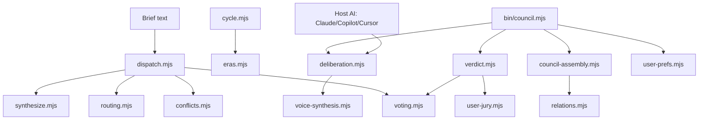

# Architecture Map - KPOP Design System v3.4.3

Default runtime is host-AI mode: Claude/Copilot/Cursor executes the protocol, while this repository keeps deterministic structure and tests.

## Engine dependency graph

## Sixteen engines table

| Engine | Purpose | Key API | Imported by | Status |
|---|---|---|---|---|
| `dispatch.mjs` | Legacy weighted council dispatcher | `parseBrief, summonCouncil` | examples, synthesize | production |
| `voting.mjs` | Weighted vote tally and eligibility | `tallyCouncilVotes` | dispatch, verdict | production |
| `routing.mjs` | Cost-aware model tier plan | `getRoutingPlan` | examples, docs | production |
| `synthesize.mjs` | Design DNA aggregation | `synthesizeDesignDNA` | examples | production |
| `conflicts.mjs` | Personal and label-dispute advisories | `checkPersonalConflict` | dispatch, examples | production |
| `eras.mjs` | Era-locked group DNA | `getEraLockedDNA` | cycle, examples | production |
| `cycle.mjs` | Comeback 30-day stage calendar | `dispatchComebackCycle` | examples | production |
| `coherence.mjs` | Multi-touchpoint consistency audit | `auditTouchpointCoherence` | examples | production |
| `generation.mjs` | Generation aesthetic lint | `checkGenerationAesthetic` | examples | production |
| `user-jury.mjs` | User vote/veto adapter | `castUserVote, tallyWithUser` | verdict, council CLI | production |
| `user-prefs.mjs` | Local preference memory | `loadUserPrefs, recordFavorite` | council CLI | production |
| `relations.mjs` | Sister group relation discovery | `getAllSisterGroups` | council-assembly | production |
| `council-assembly.mjs` | Compact mixed council assembly | `assembleCouncil` | bin/council | production |
| `voice-synthesis.mjs` | Group voice template synthesis | `synthesizeVoice` | deliberation, bin/council | production |
| `deliberation.mjs` | Host-AI protocol script generator for R1/R2/R3 | `orchestrateDeliberation` | bin/council | production |
| `verdict.mjs` | Clause classification and strict verdict | `classifyClauses, tallyVote` | bin/council | production |

## Host-AI Mode vs Standalone Mode

Host-AI mode is the primary architecture. Skill users already operate inside Claude, Copilot, Cursor, or similar tools, so the host AI is the language model. This repository does not need a second provider abstraction or API key layer.

- Host-AI mode: `deliberation.mjs` emits the structured R1/R2/R3 script; the host AI fills member speech, cross-examination, and stance synthesis.
- Standalone mode: Node executes the same deterministic scaffold and produces stub text for demos, embedding, tests, and CLI transcripts.
- Shared invariant: council assembly, token accounting, vote math, and verdict formatting remain deterministic and testable.
