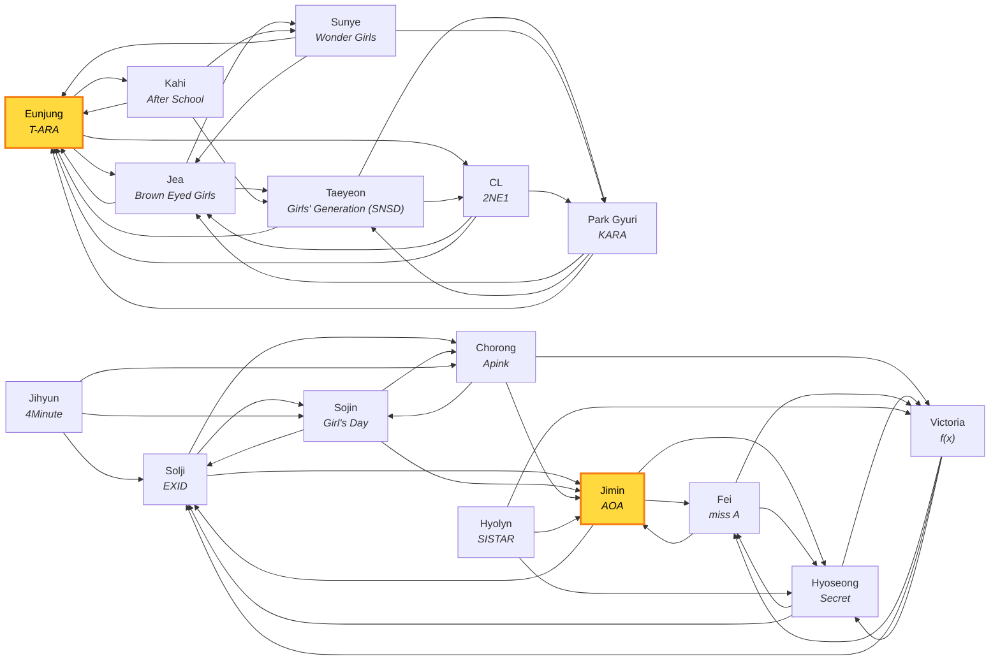
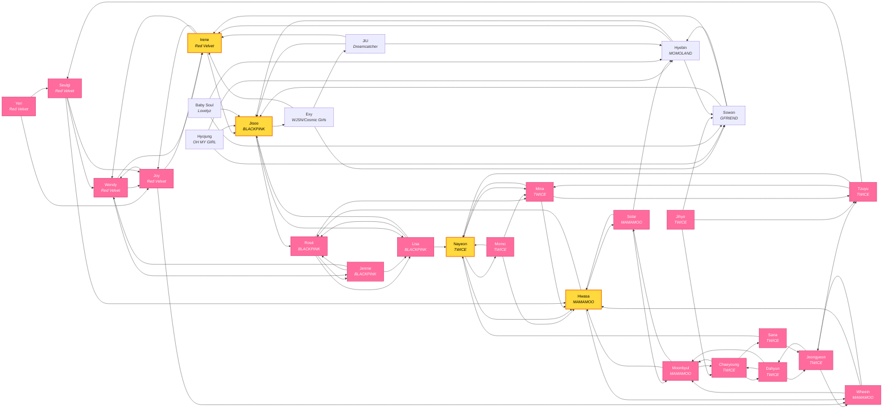
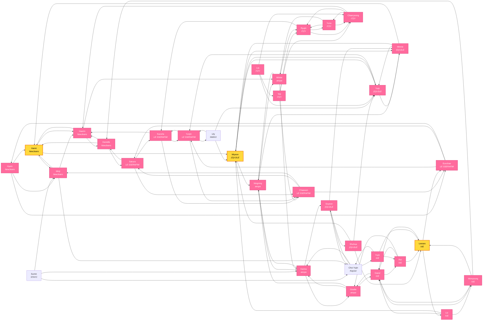
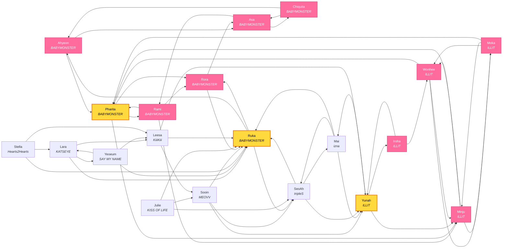
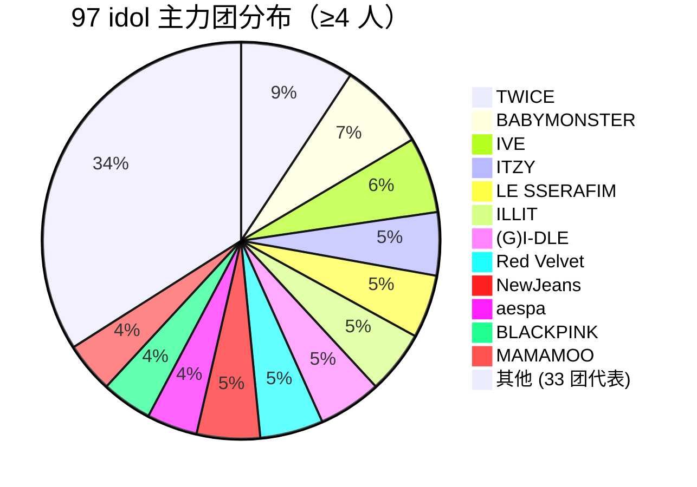

# KPOP 议会 · 全员 97 idol 网络图谱

> 自动生成 · 基于每个 agent 的 `invited_helpers` 字段
> **总计 97 idol · 291 edge · 58 bridge node (inbound >= 3)**

---

## 一、Top Bridge Nodes (跨议会共识 idol)

| 排名 | Idol | 团 | 世代 | 被邀请次数 |
|------|------|-----|------|------------|
| 1 | Ruka | BABYMONSTER | 5 代 | 9 |
| 2 | Jisoo | BLACKPINK | 3 代 | 7 |
| 3 | Miyeon | (G)I-DLE | 4 代 | 7 |
| 4 | Hwasa | MAMAMOO | 3 代 | 7 |
| 5 | Irene | Red Velvet | 3 代 | 6 |
| 6 | Eunjung | T-ARA | 2 代 | 6 |
| 7 | Nayeon | TWICE | 3 代 | 6 |
| 8 | Hanni | NewJeans | 4 代 | 5 |
| 9 | Pharita | BABYMONSTER | 5 代 | 5 |
| 10 | Leeseo | IVE | 4 代 | 5 |
| 11 | Jimin | AOA | 2.5 代 | 5 |
| 12 | Yunah | ILLIT | 5 代 | 5 |

---

## 二、按世代分图

> 🩷 粉 = Tier 0 全员议会 · 🟡 黄 = bridge node · ⚪ 白 = Tier 1 代际 leader

### Gen 2 (2007-2013)  (16 idol)

### Gen 3 (2014-2018)  (28 idol)

### Gen 4 (2019-2023)  (33 idol)

### Gen 5 (2024-)  (20 idol)

---

## 三、跨代际桥接图（仅 bridge node + 它们的 inbound 源）

```mermaid
graph TD
  bm_ruka["⭐ Ruka<br/><i>BABYMONSTER·5 代</i><br/>inbound=9"]
  bp_jisoo["⭐ Jisoo<br/><i>BLACKPINK·3 代</i><br/>inbound=7"]
  idle_miyeon["⭐ Miyeon<br/><i>(G)I-DLE·4 代</i><br/>inbound=7"]
  mmm_hwasa["⭐ Hwasa<br/><i>MAMAMOO·3 代</i><br/>inbound=7"]
  rv_irene["⭐ Irene<br/><i>Red Velvet·3 代</i><br/>inbound=6"]
  tara_eunjung["⭐ Eunjung<br/><i>T-ARA·2 代</i><br/>inbound=6"]
  twice_nayeon["⭐ Nayeon<br/><i>TWICE·3 代</i><br/>inbound=6"]
  nj_hanni["⭐ Hanni<br/><i>NewJeans·4 代</i><br/>inbound=5"]
  nj_hyein["Hyein<br/><i>NewJeans</i>"] --> nj_hanni
  idle_shuhua["Shuhua<br/><i>(G)I-DLE</i>"] --> idle_miyeon
  twice_tzuyu["Tzuyu<br/><i>TWICE</i>"] --> twice_nayeon
  bm_ahyeon["Ahyeon<br/><i>BABYMONSTER</i>"] --> idle_miyeon
  idle_yuqi["Yuqi<br/><i>(G)I-DLE</i>"] --> idle_miyeon
  mmm_wheein["Wheein<br/><i>MAMAMOO</i>"] --> mmm_hwasa
  nj_minji["Minji<br/><i>NewJeans</i>"] --> nj_hanni
  rv_wendy["Wendy<br/><i>Red Velvet</i>"] --> rv_irene
  bp_lisa["Lisa<br/><i>BLACKPINK</i>"] --> bp_jisoo
  bp_lisa["Lisa<br/><i>BLACKPINK</i>"] --> twice_nayeon
  katseye_lara["Lara<br/><i>KATSEYE</i>"] --> bm_ruka
  rv_irene["Irene<br/><i>Red Velvet</i>"] --> bp_jisoo
  nmixx_lily["Lily<br/><i>NMIXX</i>"] --> idle_miyeon
  ive_liz["Liz<br/><i>IVE</i>"] --> idle_miyeon
  snsd_taeyeon["Taeyeon<br/><i>Girls' Generation (SNSD)</i>"] --> tara_eunjung
  wg_sunye["Sunye<br/><i>Wonder Girls</i>"] --> tara_eunjung
  smn_yeoeum["Yeoeum<br/><i>SAY MY NAME</i>"] --> bm_ruka
  h2h_stella["Stella<br/><i>Hearts2Hearts</i>"] --> bm_ruka
  twice_sana["Sana<br/><i>TWICE</i>"] --> twice_nayeon
  wjsn_exy["Exy<br/><i>WJSN/Cosmic Girls</i>"] --> rv_irene
  meovv_sooin["Sooin<br/><i>MEOVV</i>"] --> bm_ruka
  omg_hyojung["Hyojung<br/><i>OH MY GIRL</i>"] --> bp_jisoo
  mmm_solar["Solar<br/><i>MAMAMOO</i>"] --> mmm_hwasa
  bm_rora["Rora<br/><i>BABYMONSTER</i>"] --> bm_ruka
  bm_rora["Rora<br/><i>BABYMONSTER</i>"] --> twice_nayeon
  beg_jea["Jea<br/><i>Brown Eyed Girls</i>"] --> tara_eunjung
  lovelyz_babysoul["Baby Soul<br/><i>Lovelyz</i>"] --> bp_jisoo
  kol_julie["Julie<br/><i>KISS OF LIFE</i>"] --> bm_ruka
  rv_joy["Joy<br/><i>Red Velvet</i>"] --> rv_irene
  2ne1_cl["CL<br/><i>2NE1</i>"] --> tara_eunjung
  nj_hanni["Hanni<br/><i>NewJeans</i>"] --> idle_miyeon
  nj_danielle["Danielle<br/><i>NewJeans</i>"] --> nj_hanni
  twice_momo["Momo<br/><i>TWICE</i>"] --> twice_nayeon
  twice_momo["Momo<br/><i>TWICE</i>"] --> mmm_hwasa
  twice_nayeon["Nayeon<br/><i>TWICE</i>"] --> mmm_hwasa
  dc_jiu["JiU<br/><i>Dreamcatcher</i>"] --> bp_jisoo
  dc_jiu["JiU<br/><i>Dreamcatcher</i>"] --> rv_irene
  kara_gyuri["Park Gyuri<br/><i>KARA</i>"] --> tara_eunjung
  mmm_moonbyul["Moonbyul<br/><i>MAMAMOO</i>"] --> mmm_hwasa
  nj_haerin["Haerin<br/><i>NewJeans</i>"] --> nj_hanni
  gfriend_sowon["Sowon<br/><i>GFRIEND</i>"] --> bp_jisoo
  gfriend_sowon["Sowon<br/><i>GFRIEND</i>"] --> rv_irene
  izna_mai["Mai<br/><i>izna</i>"] --> bm_ruka
  momoland_hyebin["Hyebin<br/><i>MOMOLAND</i>"] --> rv_irene
  momoland_hyebin["Hyebin<br/><i>MOMOLAND</i>"] --> bp_jisoo
  as_kahi["Kahi<br/><i>After School</i>"] --> tara_eunjung
  triples_saem["SeoAh<br/><i>tripleS</i>"] --> bm_ruka
  twice_mina["Mina<br/><i>TWICE</i>"] --> twice_nayeon
  twice_mina["Mina<br/><i>TWICE</i>"] --> mmm_hwasa
  idle_minnie["Minnie<br/><i>(G)I-DLE</i>"] --> idle_miyeon
  idle_minnie["Minnie<br/><i>(G)I-DLE</i>"] --> nj_hanni
  rv_seulgi["Seulgi<br/><i>Red Velvet</i>"] --> mmm_hwasa
  kiii_leesa["Leesa<br/><i>KiiiKiii</i>"] --> bm_ruka
  classDef bridge fill:#ffd93d,stroke:#f57f17,color:#000,stroke-width:3px;
  class bm_ruka,bp_jisoo,idle_miyeon,mmm_hwasa,rv_irene,tara_eunjung,twice_nayeon,nj_hanni bridge;
```

---

## 四、群组规模分布

---

> 自动生成。如需刷新，重跑生成脚本（见 commit history）。
