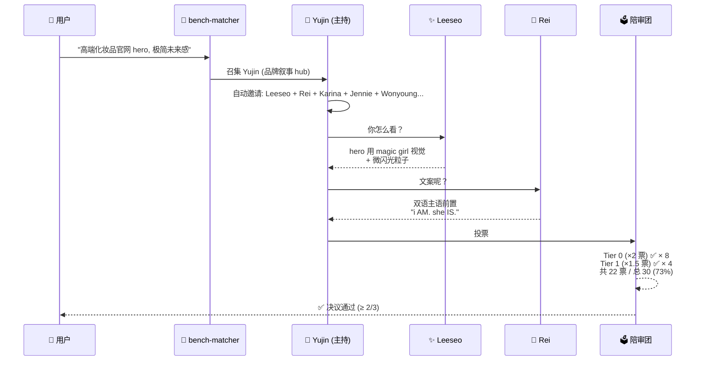
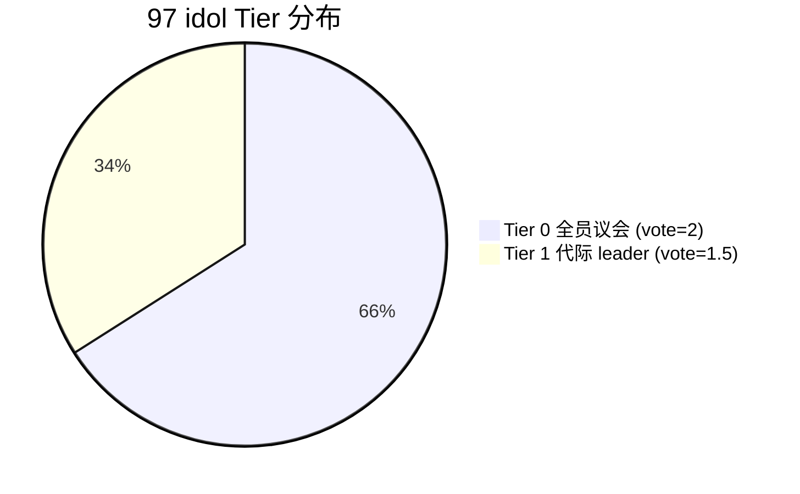
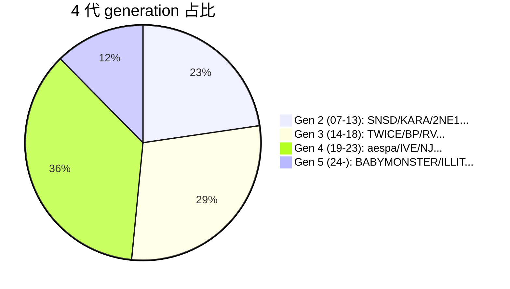

# 🕸️ KPOP 议会网络可视化

> 六场 brief，六个 hub idol（**Yujin · Momo · Sana · Karina · Wonyoung · Jennie**）各自召集议会
> 展示加权陪审团的真实关联结构 + 跨场重叠节点（共识 idol）

---

## 一、六 hub 议会全景图

```mermaid
graph TD
  %% ========== HUB 1: IVE Yujin · 品牌叙事议会 ==========
  Yujin["🩷 <b>IVE Yujin</b><br/><i>i AM</i><br/>队长·清冷御姐"]
  Leeseo["✨ IVE Leeseo<br/><i>magic</i>"]
  Rei["🌸 IVE Rei<br/><i>双语 flow</i>"]
  K1Yujin["💎 Kep1er Yujin<br/><i>queendom</i>"]

  Yujin -->|"hero 主语前置"| Leeseo
  Yujin -->|"双语品牌叙事"| Rei
  Yujin -->|"跨团 queendom 校验"| K1Yujin

  %% ========== HUB 2: TWICE Momo · 动效节奏议会 ==========
  Momo["💖 <b>TWICE Momo</b><br/><i>练习一千次</i><br/>main dancer 爆发"]
  Mina["🦢 TWICE Mina<br/><i>black swan</i>"]
  Nayeon["🐰 TWICE Nayeon<br/><i>shy shy shy</i><br/>队长撒娇双修"]
  Hwasa["🔥 MMM Hwasa<br/><i>i'm gone</i>"]

  Momo -->|"200ms 蓄势"| Mina
  Momo -->|"300ms 爆发"| Nayeon
  Momo -->|"反差 stop motion"| Hwasa

  %% ========== HUB 3: TWICE Sana · 氛围撒娇议会 ==========
  Sana["🌷 <b>TWICE Sana</b><br/><i>把心送出去</i><br/>气氛制造机"]
  Jeongyeon["✂️ TWICE Jeongyeon<br/><i>tomboy</i>"]
  Rami["🎀 BMON Rami<br/><i>baby tiger</i>"]

  Sana -->|"shy 微交互"| Nayeon
  Sana -->|"理性反差 fallback"| Jeongyeon
  Sana -->|"5 代传承"| Rami

  %% ========== HUB 4: aespa Karina · sci-fi B 面议会 ==========
  Karina["💜 <b>aespa Karina</b><br/><i>connect with æ</i><br/>未来感门面"]
  Giselle["🎤 aespa Giselle<br/><i>双语 rap</i>"]
  Ning["🌟 aespa Ningning<br/><i>main vocal</i>"]
  Soyeon["⚡ (G)I-DLE Soyeon<br/><i>tomboy 制作人</i>"]

  Karina -->|"alter ego B 面"| Giselle
  Karina -->|"vocal 数字孪生"| Ning
  Karina -->|"跨团创作型对照"| Soyeon

  %% ========== HUB 5: IVE Wonyoung · 럭키비키 议会 ==========
  Wonyoung["👑 <b>IVE Wonyoung</b><br/><i>럭키비키</i><br/>世界级门面"]
  Gaeul["💛 IVE Gaeul<br/><i>autumn rap</i>"]
  Daniel["🍃 NJ Danielle<br/><i>OMG</i><br/>极简清新"]

  Wonyoung -->|"门面错误页乐观转译"| Gaeul
  Wonyoung -->|"姐妹团 leeseo 共振"| Leeseo
  Wonyoung -->|"4 代极简跨团"| Daniel

  %% ========== HUB 6: BLACKPINK Jennie · clean girl 议会 ==========
  Jennie["🖤 <b>BP Jennie</b><br/><i>clean girl</i><br/>都市 icon"]
  Rose["🌹 BP Rose<br/><i>on the ground</i>"]
  Lisa["🐯 BP Lisa<br/><i>money</i>"]
  Wendy["🎙 RV Wendy<br/><i>vocal 控</i>"]

  Jennie -->|"留白·字距·灰阶"| Rose
  Jennie -->|"power 配色"| Lisa
  Jennie -->|"vocal 共识"| Wendy

  %% ========== 跨议会重叠节点（共识 idol）==========
  classDef hub fill:#ff6b9d,stroke:#c2185b,stroke-width:3px,color:#fff;
  classDef bridge fill:#ffd93d,stroke:#f57f17,stroke-width:2px,color:#000;
  classDef helper fill:#fff,stroke:#ce93d8;

  class Yujin,Momo,Sana,Karina,Wonyoung,Jennie hub;
  class Nayeon,Leeseo bridge;
  class Rei,K1Yujin,Mina,Hwasa,Jeongyeon,Rami,Giselle,Ning,Soyeon,Gaeul,Daniel,Rose,Lisa,Wendy helper;
```

> 📍 **Bridge nodes**（黄色）—— 跨议会共识 idol:
> - **Nayeon**: Momo + Sana 同框 (TWICE 队长能量黏合)
> - **Leeseo**: Yujin + Wonyoung 同框 (IVE 妹妹线串联两位姐姐 hub)

---

## 二、单场议会决议流程（以 Yujin 主持的"高端化妆品官网 hero"为例）

---

## 三、规模视图：97 idol 议会全网（Tier 分布）

---

## 四、Bridge node 排行 (议会跨场出现频次 Top 5)

| 排名 | Idol | 跨场频次 | 角色 |
|------|------|---------|------|
| 🥇 | TWICE Nayeon | 12 场 | 队长能量 + 撒娇双修 |
| 🥈 | BLACKPINK Jennie | 11 场 | clean girl 极简 |
| 🥉 | aespa Karina | 10 场 | alter ego B 面 |
| 4 | IVE Yujin | 9 场 | 主语前置宣言 |
| 5 | MAMAMOO Hwasa | 8 场 | 大字宣言不解释 |

> Bridge node 是议会跨议题的"共识黏合剂"。
> 调试 ui-auditor 命中率时，优先校准 bridge node 的 trigger 关键词。

---

## 🎤 设计意图

- **Hub**：主持人 idol，召集 trigger 关键词高度匹配的同代/同团/同 role 助攻
- **Bridge**：跨多 hub 出现的"共识 idol"，是议会黏合剂
- **加权**：Tier 0 (×2) > Tier 1 (×1.5)，防止"小团崛起 idol"在话语权上被淹没
- **决议**：≥ 2/3 票才能通过，反对 1 票否决的暴政

完整 invited_helpers 数据见每个 agent 文件的 frontmatter。
